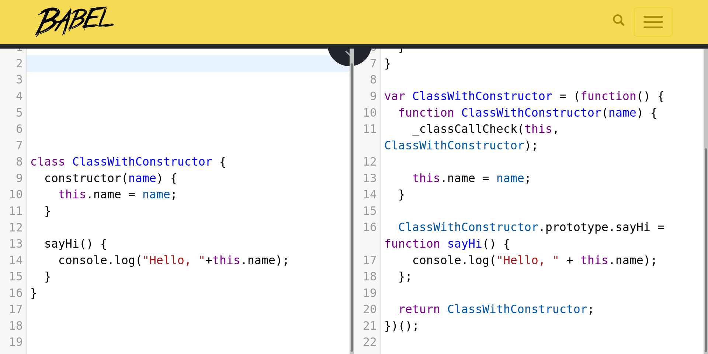

********************************************************


# JavaScript's Prototypes


---
## JavaScript's Prototypes
- What is the `prototype` in JavaScript
- Prototypal inheritance & the prototype chain
- Constructor functions & creating prototypes
- Object composition
- ES6 `class` syntax

> This part doesn't go to the speaker notes but at least it shows up nicely in the rendered markdown. Or does it really?


---
## The Prototype

```javascript
let anObject = { foo: "bar" };
console.log( Object.getPrototypeOf(anObject) );
// same as
console.log( anObject.__proto__ )
```

Prototypes are JavaScript objects that provide a "blueprint" with methods and properties/values for a group of JavaScript objects (other instances) sharing the same prototype object.

---
###  Missing prototype

- All objects in JavaScript receive a prototype.
- ...unless we explicitly specified otherwise.
- `Object.prototype` is an object that has no prototype.
- But _what is_ `Object.prototype`?

```javascript
console.log( typeof Object.prototype ); // == object

console.log( Object.getPrototypeOf( Object.prototype ) );
// == undefined
```

---
### Constructor functions

- Are just JavaScript functions
- ...but with an extra `prototype` property.
- We use `new` and a constructor function to create new object instances

```javascript
let f = function() {};
f.prototype = { createdBy: 'My constructor!' }

// The constructor function & new together wires up an object's runtime prototype
let obj = new f();
console.log( Object.getPrototypeOf( obj ) )
console.log( obj.createdBy )
```

---
### The runtime prototype
- The `<obj>.__proto__` pseudo-property is the same as the result of `Object.getPrototypeOf(<obj>)`
- This is called the _runtime prototype_
- It's used in _resolving property names_ and makes the object's _prototype chain_
- The `new` call sets the newly created object's runtime prototype so that it points to the object in the constructor's `prototype` property.

---
### The prototype chain

Objects are only allowed to have one prototype, but that prototype can have its own prototype, thus forming a _chain of prototypes_ - the **prototype chain**.

---
### Property resolution

This is also called **walking the prototype chain**.

---
## Using `Object.create()`


-------------
## ES6 Classes

---
### Classic syntax

```javascript
var Proto = Object.create(null);

Proto.sayHi = function() {
  console.log("Hello" + (this.name ? " my name is"+this.name : "") + "!");
};

var anonymous = Object.create(Proto);
anonymous.sayHi();

var xy = Object.create(Proto);
xy.name = "X. Y.";
xy.sayHi();
```

---
### Classy new syntax

```javascript
class ClassicProto {
  sayHi() {
    console.log("Hello" + (this.name ? " my name is"+this.name : "") + "!");
    // notice this method body is exactly the same as for the above
  }
};

var classyAnonymous = new ClassicProto();
var classyXY = new ClassicProto();

classyXY.name = "Classy X. Y.";

classyAnonymous.sayHi();
classyXY.sayHi();
```

---
### Constructor function vs class constructor
```javascript
// Pre-ES6 syntax
function ConstructorFn(name) {
  this.name = name;
}
ConstructorFn.prototype = { sayHi: function() { console.log("Hello, "+this.name); } }

// ES6+ syntax
class ClassWithConstructor {
  constructor(name) {
    this.name = name;
  }
  sayHi() {
    console.log("Hello, "+this.name);
  }
}
```

---
### Classes are a _"syntax sugar"_
```javascript
// They look & behave the same
let bob = new ConstructorFn("Bob");
bob.sayHi();

let alice = new ClassWithConstructor("Alice");
alice.sayHi();
```

Syntax (or syntactic) sugar means "not adding new fundamental syntax or functionality, but exposing existing functionality in a different, more ergonomic manner".

---
### ES6 `class` syntax in older browsers
- Older browsers don't understand the new syntax
- Transpilers like Babel can translate the new syntax to the old
- [Try it online at Babel.io](http://babeljs.io/repl/#?babili=false&browsers=&build=&builtIns=false&code_lz=MYGwhgzhAEDC5QOoEsAuALWB7AdhVATgK7CpYHQDeAUNNMLvsaeQBQ5gC2ApgJRW060DMggA6Dj2gBeaJO4BuQQF9qgiGACeACWSt-NIfUZYQ3MSCwBzVgCJt3EJYA00WwGoR4-byV1VqmpAA&debug=false&forceAllTransforms=false&shippedProposals=false&circleciRepo=&evaluate=false&fileSize=false&lineWrap=true&presets=es2015-loose&prettier=true&targets=&version=6.26.0&envVersion=)

---



---
### Advantages of class syntax

* Interoperable (across objects, authors, libraries)
* Standardized shape
* Easier to understand for OO developers


********************************************************


# Functions & Scope


----------------------------------
## Functions & Scope in JavaScript

+ Function context / `this`
+ Functions & methods
+ Scopes
+ IIFE
+ Closure
+ Block scope ES6


********************************************************


# Useful patterns in JavaScript


----------------------------------
## Useful JS & functional patterns

* Sync vs Async callbacks
* Chaining method calls
* Asynchronous chains: Promises


---
## Callbacks

---
## Sync vs Async callbacks

---
## Method chaining

---
## Method chaining in jQuery

---
## Promises

```javascript
let promise = new Promise(function(resolve, reject) {
    setTimeout(function() {
        resolve("Gone in 1s!");
    }, 1000);
});

promise.then(function(msg) {
    console.log(msg);
});
```

> Promises are a new asynchronous primitive for controlling your code, and a great way to complement your APIs (a lot of new APIs in the ES and DOM specs make extensive use of promises). A *promise* represents a *token* that gets returned for an asynchronous operation. As soon as said operation finishes, the promise will present its value (or, in case the operation *failed*, the promise notifies you that the promise failed to produce an actionable value).  

---
## Consuming promises
```javascript
fetch("http://example.com/").then(function(result) {
    return result.json(); // <- also a promise!
}).then(function(json) {
    console.log(json);
}).catch(function(error) {
    console.error("Uh-oh!", error);
}).finally(function() {
    console.log("One way or another... I'm done!");
});
```

Use `then`/`catch`/`finally` on promises (lots of libraries & DOM methods use, or _can return_ Promises).

> Promises results are used by attaching event handlers to them for *promise fulfillment* (`.then()`) and *rejection* (`.catch()`). `.finally()` is a new addition to this mix, its callback will execute when the promise is *settled*, that is, *either* fulfilled or rejected.


********************************************************


# Web APIs


------------------------
## Commonly used Web APIs

* About the DOM APIs
* Cliend-side networking & the `fetch` API
* The HTML5 `canvas`
* Client-side storage


********************************************************


# Node.js


----------
## Node.js

* Intro, Async I/O + Single Thread
* The event loop in Node.js
* I/O - file handling, streams
* Web services - Express / Restify
* Low-level networking


********************************************************


# Frontend tooling


-------------------
## Frontend tooling

* What is the usecase
* Grunt/Gulp
* Webpack
